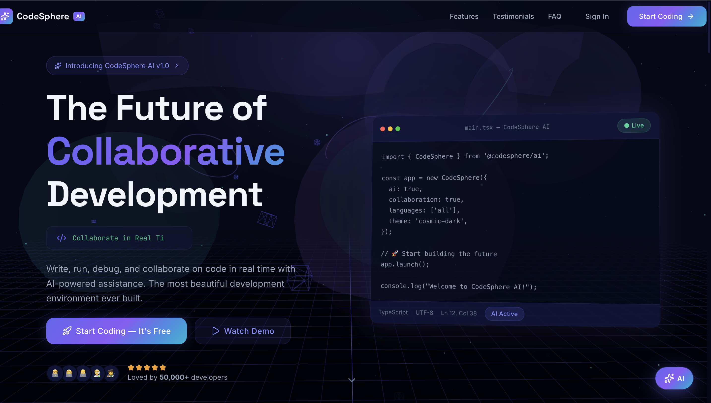
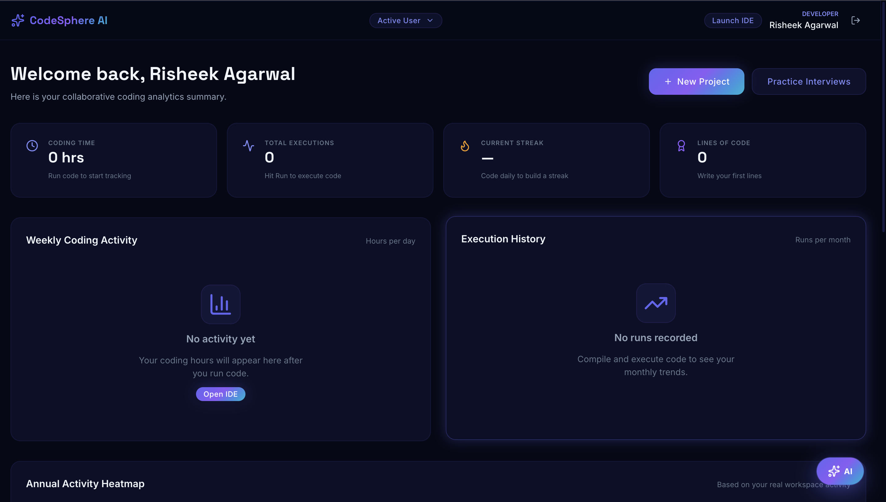
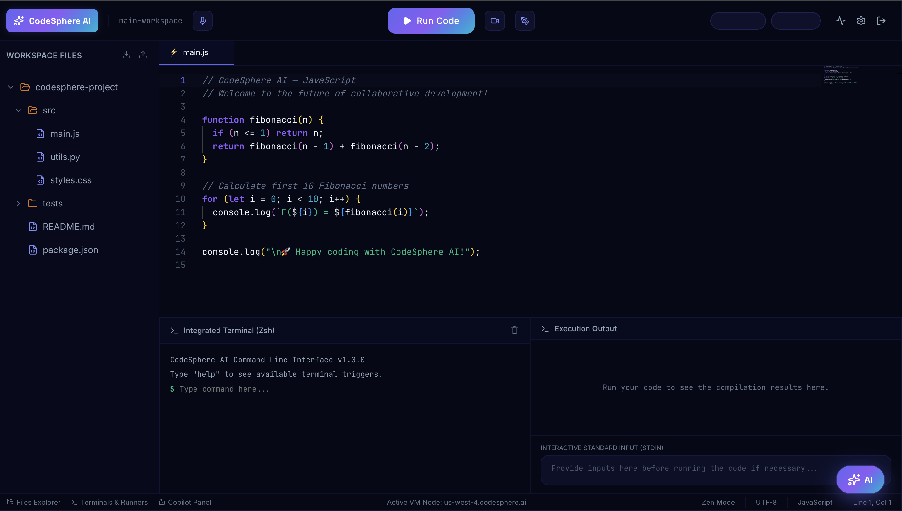
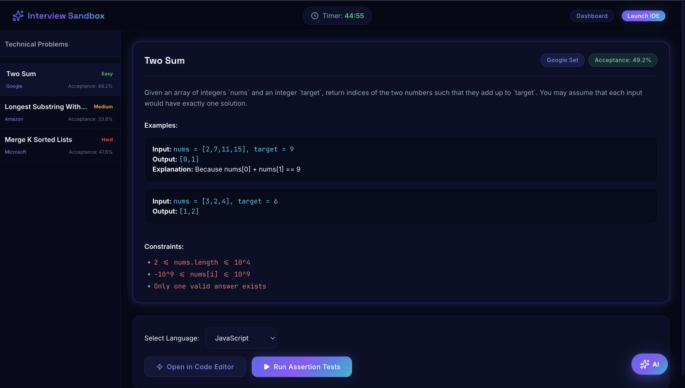
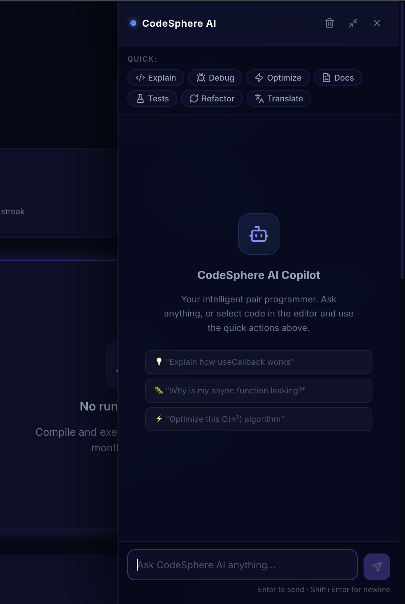
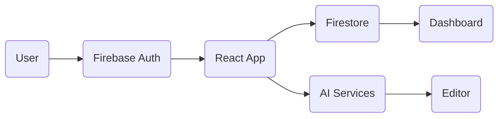

# 🚀 CodeSphere AI

<p align="center">
<h1 align="center">CodeSphere AI</h1>
<p align="center"><strong>AI-Powered Collaborative Coding Platform</strong></p>
</p>

<p align="center">


</p>

## 🌟 Overview

CodeSphere AI is a modern collaborative coding platform featuring Firebase Authentication, AI-powered assistance, Monaco Editor, Firestore integration, analytics, interview practice, and a clean developer experience.

# 📸 Preview

| Landing | Dashboard |
|---------|-----------|
|  |  |

| Code Editor | Interview |
|-------------|-----------|
|  |  |

| AI Help |
|------------|
|  |

## ✨ Features

- Firebase Google Authentication
- AI Coding Assistant
- Monaco Code Editor
- Dashboard Analytics
- Interview Practice
- Community Module
- Firestore Database
- Responsive UI
- Dark Theme

## 🏗️ Architecture



## 🛠 Tech Stack

| Layer | Technology |
|------|------------|
| Frontend | React + TypeScript + Vite |
| Backend | Firebase |
| Database | Firestore |
| Editor | Monaco |
| Hosting | Vercel |

## 📂 Folder Structure

```text
src/
 ├── components
 ├── features
 ├── hooks
 ├── services
 ├── stores
 ├── styles
 └── utils
```

## ⚙️ Installation

```bash
git clone https://github.com/risheek2005/CodeSphere-AI.git
cd CodeSphere-AI
npm install
npm run dev
```

## 🔑 Environment Variables

```env
VITE_FIREBASE_API_KEY=
VITE_FIREBASE_AUTH_DOMAIN=
VITE_FIREBASE_PROJECT_ID=
VITE_FIREBASE_STORAGE_BUCKET=
VITE_FIREBASE_MESSAGING_SENDER_ID=
VITE_FIREBASE_APP_ID=
```

## 🚀 Deployment

Deploy on Vercel and configure the above environment variables.

## 🗺️ Roadmap

- ✅ Authentication
- ✅ Dashboard
- ✅ Editor
- ✅ AI Assistant
- ⏳ Realtime Collaboration
- ⏳ Video Calling
- ⏳ Docker

## 🤝 Contributing

Pull requests are welcome.

## 👨‍💻 Author

**Risheek Agarwal**

GitHub: https://github.com/risheek2005

LinkedIn: https://www.linkedin.com/in/risheek-agarwal-161b83338

## ⭐ Star the repository if you like it!
